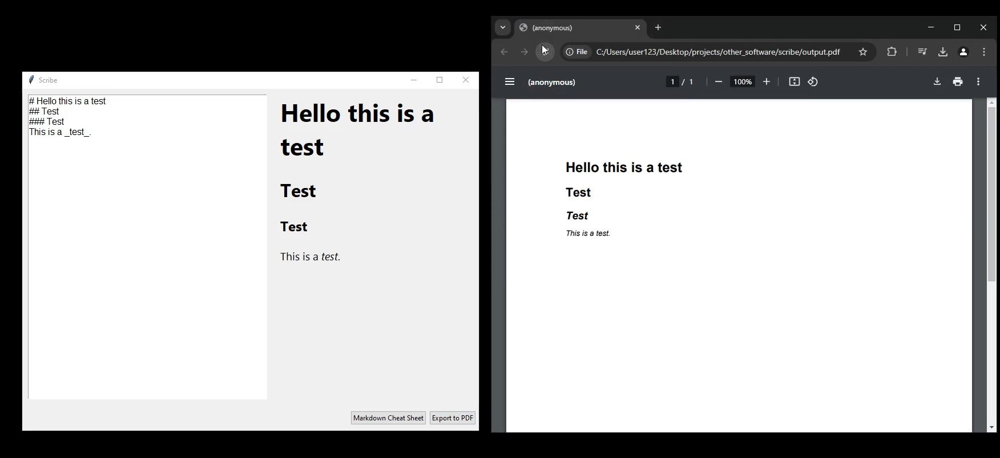

## Scribe
A Python based GUI application to write, preview, and export Markdown content as a PDF file.

[](scribe-demo.mp4)

## About
Scribe is a text editor that allows you to write in Markdown with a live preview window and then export your Markdown content as a pdf.

## Requirements
Make sure you have the following installed:
- **Python 3**: https://www.python.org/downloads/

## Instructions
1. Clone the repository
```
git clone https://github.com/finitesphere/scribe
```
2. Go to the project
```
cd scribe
```
3. Install the dependencies
```
pip install -r requirements.txt
```
4. Run Scribe
```
python scribe.py
```
## TO DO:
- [ ] Fix newline style not appearing on pdf due to certain Markdown styles
- [ ] Better UI
- [ ] Toolbar
- [ ] Different UI themes
- [ ] Emoji support
